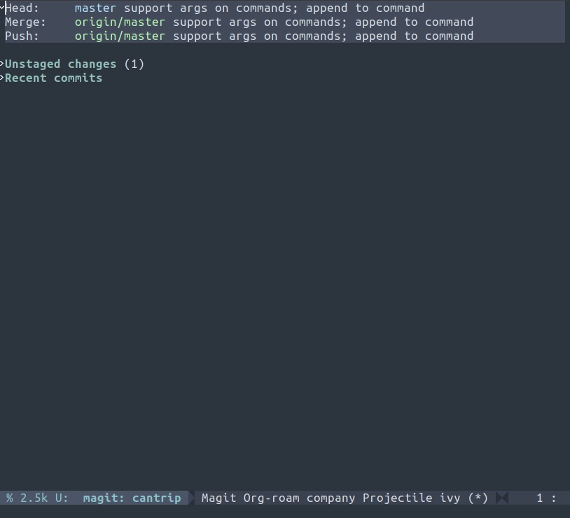

  <h1>Cantrip</h1>
  
An Emacs package for building transient prefixes from JSON files.

## Installation

Clone this repository:

    git clone https://github.com/johncoder/cantrip

Then, add this to your emacs configuration:

    (load-file "~/path/to/cantrip/cantrip.el")

By default, it binds to `C-x a r`, and looks for `package.json` or `scripts.json` in the dominating directory that contains a `.git` folder.

A scripts file looks something like this:

    {
      "scripts": {
        "two": "pwd",
        "foo": "ls -la",
        "foo:bar": "git status",
        "foo:baz": "date",
        "foo:bar:qaz": "cat scripts.json | grep \"git\""
      }
    }

Cantrip uses a `:` delimited convention for chaining transient prefixes. It will automatically select an alias for segments using the unique letters of the label, or overflow to another option when necessary. When you execute one of the scripts, it uses projectile to run the respective script as a compilation command within the project.
